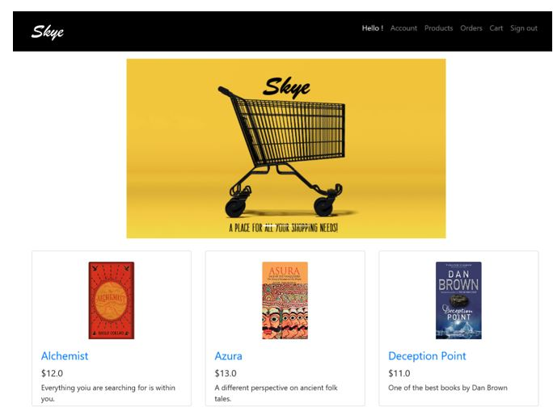

# Skye - A Marketplace Portal (Amazon Clone) 

The marketplace portal – Skye, is a Spring MVC web application. The application uses hibernate for database interactions with MySQL database. Users can register either as a seller or a customer. Depending on their role, various tasks can be performed. Seller can enlist their products in the application and customer can buy the products and track their orders.

## Technologies

Backend
- Spring MVC
- Hibernate
-Ajax
Frontend
-  HTML
- CSS
- JavaScript
- Bootstrap – A bootstrap template was used as a reference from startbootstrap.com.
Database
- MySQL

## Requirement
- Java SE
- Tomcat

## Programming Language 
- Java SE

## Development Tools
- Netbeans IDE

## FrameWork
- SpringMVC

## Roles and Tasks Performed
There are two user roles in this project:
- Customer
- Seller
Common Tasks:
- The customer and seller have to first register with the Skye web application, then they can login to get access to their respective pages.
Customer Tasks:
-  The customers can view all products and search products based on category.
-  They can add products to the cart and place an order for the products in the cart.
-  View all the previous orders and view each order details including the products ordered separately. This list can also be generated as a pdf.
- The order tracking details are visible.
Seller Tasks:
- The sellers can perform CRUD operation on categories/departments.
-  They can enlist products in the marketplace. They can perform CRUD operation on the enlisted products. The quantity of products keeps reducing based on the orders and can be updated by the seller.
-  View the list of products enlisted by the specific seller.
-  Only the orders received for the items enlisted by the specific user will be visible for the seller and not the whole order items.
-  They can process, delete, and ship products.

## Functionality Performed
- Spring MVC with Annotated Controllers
-  Hibernate with Annotated POJOs
- Role to role interaction (Web 2.0) – seller enlist products and customer can buy the products.
-  Interceptors were used to ensure that the webpages for the specific user role is accessed only by the users registered under that role
-  One-to-one mapping 
-  Many-to-one mapping 
-  Spring validation and Hibernate validation was used to validate the form inputs. 
- PDF of the order items in an order is generated on request.
-  Uploading an image when adding a product.
- AJAX was used to display a list of products that falls under the specific category.
-  Exception Handling for 404 error and AdException.
- Dependency injection.
-  HQL and criteria query was used.
- Products by all sellers will be visible by the customer.
- Each seller can only see orders for their enlisted products and not the complete list of order items in one order by the customer.
-  Once an order is placed the cart is cleared.
-  CRUD operations for products and departments.
-  Add and update for addresses and user contact details.

